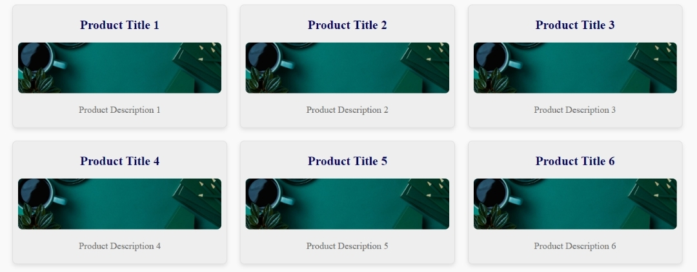

# Product Interface - JavaScript Project

This project is a simple, dynamic product interface built from scratch using **Vanilla JavaScript**. The interface displays a collection of product cards with titles, descriptions, and images, making it perfect for e-commerce websites or product showcases.

## Features

- 🛠 **Built with Pure JavaScript**: No frameworks or libraries involved.
- 📱 **Responsive Design**: The interface is fully responsive and adapts to various screen sizes.
- 🖼 **Dynamic Content**: Product titles, descriptions, and images are dynamically generated.
- 🎨 **Customizable**: Easily tweak the design and content to fit any use case.

## Project Structure

- `index.html`: The main HTML file that renders the product interface.
- `style.css`: The CSS file for styling the product cards and layout.
- `script.js`: The JavaScript file that dynamically generates the product cards and handles any interactions.

## Screenshots

